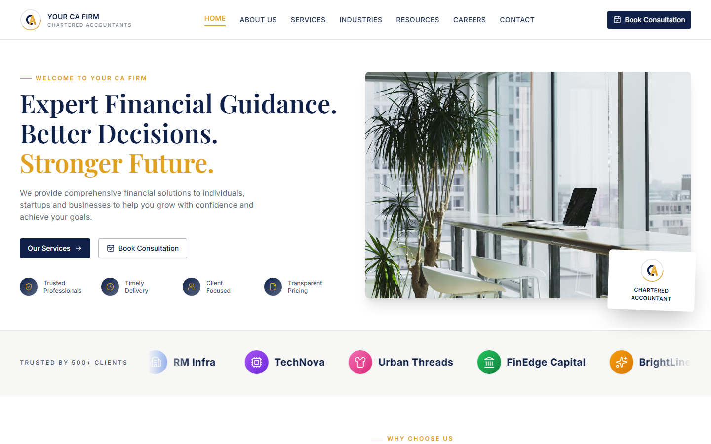
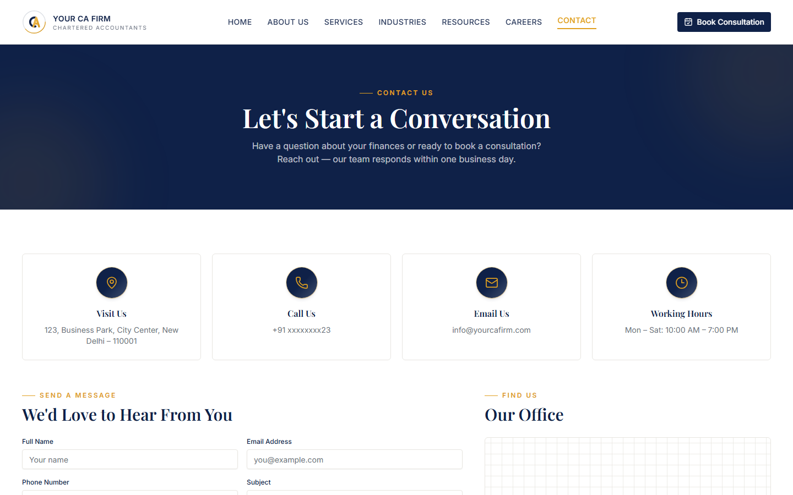

# Your CA Firm

**Free React Chartered Accountant / Financial Services Website Template**

A polished, fully responsive marketing website for a chartered accountancy or financial advisory firm — a cinematic hero, an auto-scrolling client-logo marquee, service and industry grids, a process timeline, testimonials, a newsletter panel, and dedicated Careers and Contact pages, all in a warm navy-and-gold design system.

[**Live Preview**](https://ca-firm.codespanda.com/) · [View on GitHub](https://github.com/codespanda/CA-Firm) · MIT License

---




---

## What is this?

**Your CA Firm** is a free, open-source React template built for chartered accountants, tax consultants, audit firms and financial advisory practices. It packs a complete multi-page marketing site — home page, careers, and contact — into a single codebase, with every section built as an independent, swappable component.

Built with **React 19**, **Vite**, **Tailwind CSS v4**, **shadcn/ui**, and **React Router**, every section is production-ready: real form validation and success states, keyboard-accessible interactive elements, and a fully responsive layout from mobile through desktop.

### Who is it for?

- Developers building a website for a CA firm, tax consultancy, or accounting practice
- Agencies delivering professional-services / financial-advisory sites for clients
- Freelancers who want a polished, ready-to-customize starter instead of building from scratch
- Anyone who wants a clean reference for a Tailwind v4 + shadcn/ui + React Router setup

## What's included

| Section | Description |
|---|---|
| **Header** | Sticky navigation with active-link highlighting, mobile menu, and a "Book Consultation" CTA |
| **Hero** | Two-column hero with trust badges and a floating logo card |
| **Trusted By** | Auto-scrolling, pause-on-hover client-logo marquee that links into testimonials |
| **Why Choose Us** | Icon-led value list paired with a photo and a floating stat card |
| **About** | Company story with a 4-stat counter row |
| **Services** | 6-card grid of core service offerings |
| **Industries** | 8-industry icon grid |
| **Engagement Models** | 4 flexible engagement/pricing cards with a "Popular" badge |
| **Our Process** | 4-step numbered process timeline |
| **Testimonials** | Rotating client quotes with colorful client logo chips |
| **Newsletter** | Standalone subscribe panel with a working success state |
| **Insights** | Blog/resources preview grid |
| **Footer** | CTA band, sitemap columns, masked contact number, and social links |
| **Careers page** | Values, benefits grid, open-roles list, and a general-application form |
| **Contact page** | Contact-info cards, a full inquiry form, an office-location panel, and an FAQ accordion |

## Why this template

- **Component-driven** — every section (`src/components/sections/*`) is a standalone component you can reorder, remove, or restyle independently
- **shadcn/ui primitives** — Button, Card, Input, Badge, and Accordion, themed to a navy/gold palette via CSS variables
- **React Router pages** — Home, Careers, and Contact as real routes, with hash-anchor scrolling back to home-page sections
- **Real interactivity** — working forms with success states, an accessible auto-pausing marquee, a masked phone number, an active-state nav
- **Mobile-first & responsive** — every section reflows cleanly from a 375px phone up to a 4K desktop
- **GitHub Pages ready** — ships with the SPA 404-redirect trick so client-side routes work correctly on GitHub Pages, including under a custom domain

## Tech stack

React · TypeScript · Vite · Tailwind CSS v4 · shadcn/ui · React Router · lucide-react

## Getting started

Node.js 18+ required.

```bash
# 1. Clone the repo
git clone https://github.com/codespanda/CA-Firm.git
cd CA-Firm

# 2. Install dependencies
npm install

# 3. Start the dev server
npm run dev

# 4. Open in browser
http://localhost:5173/
```

### Other scripts

```bash
npm run build     # type-check and build for production
npm run preview   # preview the production build locally
npm run deploy    # build and publish dist/ to the gh-pages branch
```

## Customizing

- **Colors & fonts** — edit the CSS variables and `@theme` block in [`src/index.css`](src/index.css) (navy/gold palette, Playfair Display + Inter)
- **Content** — each section's copy and data live as typed arrays at the top of its component file, e.g. `SERVICES` in [`Services.tsx`](src/components/sections/Services.tsx)
- **Logo** — swap the SVG monogram in [`src/components/Logo.tsx`](src/components/Logo.tsx)
- **Pages** — add new routes in [`src/App.tsx`](src/App.tsx) alongside the existing Home/Careers/Contact routes

## FAQ

**Can I use this for a commercial website?**
Yes — it's MIT licensed. Use it for client work, your own firm's site, or any commercial project, no attribution required.

**Does it work for firms other than chartered accountants?**
Easily — the section content is all data-driven. Swap the copy, services list, and industries grid and it adapts to any professional-services firm (legal, consulting, financial advisory, etc.).

**Is there a real backend?**
No — it's a UI-only template. The contact and newsletter forms manage their own state locally and show a success message on submit; wiring them to a real API or form service is left to you.

**Why Tailwind CSS v4?**
The template is built on Tailwind v4's CSS-first configuration and Vite. If you need v3, a find-and-replace on the `@theme`/CSS-variable tokens in `index.css` will get you most of the way there.

## License

MIT — free for personal and commercial use.
